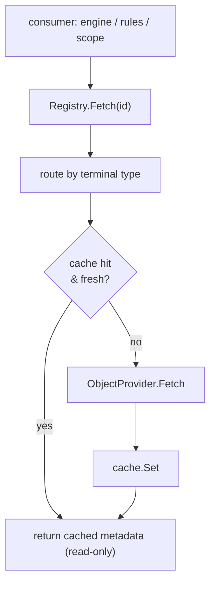

# Providers

A [rule](rules.md) reads `object.classification`; an [exclusive scope](scopes.md)
enumerates "every document in this account." Both need *domain data* Aperture
does not own. That data belongs to the **host application** — its database, its
API, its source of truth — and Aperture reaches it through **providers**. A host
implements one `ObjectProvider` per object-type; a `Registry` binds each type to
its provider plus a per-type cache and is the seam every consumer resolves
through. The code lives in the `provider` package; `csvprovider` is a concrete
worked example.

A load-bearing rule: **Aperture never persists provider data as a source of
truth.** The host owns it; Aperture only ever caches a copy. Cached metadata is
handed back **by reference and treated read-only** — the cache never copies a map
on read (allocation matters on the `Check` hot path), so a provider must return a
fresh map per object and callers must never write to a returned map. Because a
value may nest, that contract is **transitive**; see
[the read-only contract](#the-read-only-contract-is-transitive) below.

## `ObjectProvider`: the host seam

A host implements this once per object-type. It is a pull source — Aperture asks,
the host answers — and must be safe for concurrent use:

```go
type ObjectProvider interface {
    Fetch(ctx context.Context, id identity.Identity) (Metadata, error)
    List(ctx context.Context) ([]Object, error)
    Query(ctx context.Context, filter Filter) ([]Object, error)
}
```

- **`Fetch`** returns one object's metadata; a missing object yields an
  `APERTURE_NOT_FOUND` coded error, so the Registry can tell "absent" from an
  operational failure.
- **`List`** is the unfiltered enumeration of the type.
- **`Query`** returns the objects matching a `Filter` — an optional `Pattern`
  (bounds results to matching identities), a set of `Fields` predicates, and a
  `Limit`. The zero `Filter` selects everything (equivalent to `List`).

`Metadata` is `map[string]any` — an **alias**, not a named type — so the rules
engine reads each field straight into its expression environment with no
conversion layer. An `Object` pairs an identity with its metadata; the identity's
terminal segment type is the object-type the provider is registered under.

### The `Filter.Fields` contract

A provider *evaluates* `Fields`, but it does not get to *define* it. `Query` is
how [scope](scopes.md) enumeration bounds itself, so two providers disagreeing
about what `Fields{"tags": "premium"}` selects is two different answers to the
same authorization question. The rule is stated once on `provider.Filter` and
implemented once in `provider.MatchFields`; an implementation either calls that
helper or reproduces it exactly (by pushing the predicate into SQL, say).

| Field value | Want | Rule |
|---|---|---|
| `["premium","launch"]` | `"premium"` | **membership** — true |
| `["premium-trial"]` | `"premium"` | membership — **false**, never substring |
| `[3, 5]` (`int64`) | `5` | membership — true |
| `[3, 5]` (`int64`) | `"5"` | **false** — a number is not its string spelling |
| `"gold"` | `"gold"` | equality — true |
| `{"dept":"eng"}` | `"dept"` | equality — **false**, *not* key membership |
| `{"dept":"eng"}` | `{"dept":"eng"}` | equality — true |
| *(field absent)* | anything, `nil` included | **false** |

Three properties are worth stating outright, because each one closes a failure
mode:

- **A collection field matches by membership.** Equality against a whole array
  is never what a caller filtering on a tag list means, and the predicate this
  replaced compared against the array's *literal rendering* (`[premium launch]`),
  so a tag filter could not match anything useful.
- **Comparison is typed, not stringly.** Numbers compare across Go numeric types
  by value (`int(5)`, `int64(5)`, `float64(5)` are one value), but a number never
  equals `"5"` and a string equals only a string. These are the [rules
  engine](rules.md)'s own comparison semantics, so `Enumerate` cannot select an
  object that a `Check` over the same value then denies. `provider.ValuesEqual`
  is the exported leaf comparison, and `csvprovider`'s
  `membership_equivalence_test.go` runs it against a real compiled rule to keep
  the two from drifting.
- **Every predicate must hold** (the map is an AND), and an object field is
  compared *by equality*, never by key membership — so a scalar want against one
  is a plain `false`, not a panic and not an accidental rendering match.

Because `provider` is a strict leaf (`identity` + `errors` + stdlib), `ValuesEqual`
**reimplements** the evaluator's equality rather than importing `expr-lang`. It
agrees with it on every value the metadata value model admits; the two documented
divergences — `time.Time`/`time.Duration`, and a `uint64` above `math.MaxInt64` —
are both outside that model.

## The metadata value model

`Metadata` is an alias, so the *type* constrains nothing. The **shape** of a field
value is constrained anyway, and deliberately so: metadata goes into the
expression evaluator untranslated, which means a wrong shape is not a `false`
decision — it is a *runtime evaluation error* on the `Check` hot path
(`operator "in" not defined on string`). Catching that at load is the whole point
of the model.

A field value is one of:

| Kind | Go type | Example |
|---|---|---|
| **scalar** | `nil`, `bool`, `string`, any Go integer/float, `json.Number` | `classification: "secret"` |
| **array** | `[]any` whose elements are **all scalars** | `tags: ["eng", "oncall"]` |
| **object** | `map[string]any` of scalars, scalar arrays, or one further object level | `owner: {dept: "eng"}` |

Two rules bound it:

- **Arrays of objects are rejected at any position.** Rule authors compare against
  arrays with `in` / `not in`, which has no useful meaning over a list of maps.
  Nested arrays (`[["a"]]`) are rejected for the same reason.
- **Typed containers are rejected** — `[]string`, `map[string]string`, structs.
  The model is spelled in the two types the expression environment and JSON share,
  so a loader normalises once instead of every consumer type-switching.

`time.Time` is deliberately **not** a scalar: a rule literal is a JSON scalar and
could never be compared against one, so a loader formats timestamps as RFC 3339
strings.

### Dates are string scalars, in two canonical forms

A date is **not a fourth shape** — it is a string scalar a loader has been told is
a date. Such a string must be one of exactly two forms, both UTC:

| Form | Layout | Example |
|---|---|---|
| calendar day | `2006-01-02` | `2026-03-04` |
| timestamp | `2006-01-02T15:04:05Z` | `2026-03-04T01:02:03Z` |

Granularity is carried by the string itself, so no type tag travels beside the
value. An offset-free timestamp is read as UTC and fractional seconds are
**truncated**, never rounded. An **explicit offset is rejected** rather than
converted: a host writing `2026-01-01T00:00:00+05:00` means January 1st, but the
UTC instant is `2025-12-31T19:00:00Z`, so accepting it would silently move the
calendar day and year.

The value model itself stays date-blind — `ValidateField` cannot know which
strings a host means as dates, so it keeps accepting any string. Declaring a
field to be a date, and running its values through `provider.ParseDateValue`, is
a loader's job — in `csvprovider` that is the
[`:date` / `:datetime` column suffix](#date-columns), and in a seed document the
[`field_types:` section](seed.md#declared-field-types). A rejection is
`APERTURE_CONFIG_INVALID` carrying a machine-
readable `reason` (`provider.DateReasonOf`) and never the value, because a date
can be personal data. Comparison goes through `DateValue.Compare`, which compares
**instants**: `"2026-03-04"` and `"2026-03-04T00:00:00Z"` are the same moment but
sort differently as text, so comparing the stored strings would be wrong at
exactly that boundary.

### Depth, counted below the field root

`provider.ValueDepth(v)` reports a value's container depth: every array or object
entered adds one level, so a scalar is `0` and an empty container is `1`. The cap
is **2** by default.

| Value | Depth | Legal? |
|---|---|---|
| `tags: ["a", "b"]` | 1 | yes |
| `owner: {dept: "eng"}` | 1 | yes |
| `owner: {lead: {name: "x"}}` | 2 | yes |
| `owner: {tags: ["a"]}` | 2 | yes |
| `owner: {a: {b: {c: "x"}}}` | 3 | no — past the depth cap |
| `owner: {members: [{id: 1}]}` | 3 | no — array of objects |
| `tags: [{name: "a"}]` | 2 | no — array of objects |

### Size, measured structurally

`provider.ValueBytes(v)` measures a value without serialising it (nothing is
allocated on a load path): a string costs its length in **bytes**, a number 8, a
bool 1, `nil` 0, an array the sum of its elements, and an object the sum of
`len(key) + value` per entry. Container framing costs nothing. The cap is **64
KiB per field value** by default.

### Validating at load

Validation is **load-time**, in one place, called by every loader — CSV today,
the inline seed next, a database-backed provider later. That is what lets a new
loader inherit the semantics instead of renegotiating them.

```go
// defaults: depth 2, 64KiB per value
if err := provider.ValidateMetadata(md); err != nil { return err }

// or tune the caps — the zero ValueLimits means "the defaults", and any
// field left zero keeps its default
limits := provider.ValueLimits{MaxDepth: 3}
if err := limits.ValidateMetadata(md); err != nil { return err }

// one field at a time, for a loader that reports per-column
err := provider.ValidateField("tags", []any{"eng", "oncall"})
```

A violation is `APERTURE_METADATA_INVALID`. Its context carries the **field
name**, the **path within the value** (`owner.members[0]`), and the offending Go
**type** — never the value itself, so a validation failure can be logged and
surfaced without leaking one account's data into another's diagnostics. Fields
and object keys are walked in sorted order, so a document with several offenders
always reports the same one.

### The read-only contract is transitive

Once a value can nest, "cached metadata is read-only" has to reach all the way
down. The cache stores the provider's map **by reference** and never copies it on
read, so the nested maps and slices inside it are shared too — appending to a
`[]any` you got back races every other reader exactly as writing the top-level
map would.

- A provider returns a **fresh** map per object, with fresh nested containers. It
  must not hand out a value it also retains and mutates, and reloading a source
  builds a new value rather than editing the old one in place.
- **No holder** — engine, rules, scope, CLI, server, host code — writes to a
  `Metadata` it was given, **at any depth**.
- A consumer that needs to modify metadata copies it (deeply) first.

## The Registry: binding, cache, invalidation

`provider.NewRegistry()` returns an empty registry; `Register(objectType,
provider, opts...)` binds a provider to a type with a per-type cache (rejecting an
empty type, a nil provider, or a duplicate with `APERTURE_PROVIDER_INVALID`). The
registry is concurrency-safe: providers register at startup and are read on the
hot path under an `RWMutex`, and each per-type cache is independently safe.

`Registry.Fetch(ctx, id)` is the read path consumers use. It routes by the id's
terminal segment type (an unregistered type is `APERTURE_PROVIDER_UNREGISTERED`),
serves from the type's cache when fresh, and otherwise pulls through the provider
and caches the result — a cache hit never calls the provider. A host provider's
error is normalised by `providerError`: one already carrying an `APERTURE_*` code
passes through verbatim (so its `APERTURE_NOT_FOUND` reaches the caller intact),
while a plain error is wrapped as `APERTURE_PROVIDER_FETCH`.



The registry serves two other roles by matching contracts from other packages
**without importing them**:

- **`Fetch` is a `rules.MetadataFetcher`** — its signature is exactly what the
  [rules Engine](rules.md) wants for object metadata, so a `*Registry` is wired in
  as the fetcher directly.
- **`List(ctx, objectType, pattern, limit)` is a `scope.ObjectLister`** —
  byte-for-byte the seam the [implicit/exclusive scope resolvers](scopes.md) left
  open, so a `*Registry` is passed as `engine.ScopeDeps{Lister: reg}`. It queries
  the provider, bounds the result by the pattern and the limit
  (`DefaultListLimit` = 1000), and opportunistically warms the cache with each
  returned object's metadata.

Two enumeration variants sit beside the bounded `List`: `Identifiers` returns the
**complete, unbounded** id set (sorted, for a stable diff — use it to expand an
exclusive allowance into a positive allow-list), and `IdentifiersExcept` is
`Identifiers` minus an excluded set.

### Cache tuning and invalidation

Each type's cache is an in-memory LRU (`MemoryCache`) behind the pluggable
`CacheBackend` interface, tuned per type at registration:

| Option | Default | Effect |
|---|---|---|
| `WithTTL(d)` | `DefaultTTL` = 30s | freshness window; `d ≤ 0` disables expiry |
| `WithMaxSize(n)` | `DefaultMaxSize` = 10 000 | LRU cap; `n ≤ 0` means unbounded |
| `WithClock(now)` | `time.Now` | injectable clock for deterministic TTL tests |

Invalidation is explicit: `Invalidate(id)` drops one object, `InvalidateType`
clears a type, `InvalidateAll` clears every cache. `Stats(objectType)` exposes
`Hits / Misses / Evictions / Expirations / Invalidations / Entries` for
observability and the latency benchmark. The `provider` package depends only on
`identity` and `errors` — never scope, engine, or model — so it stays a leaf.

## Worked example: `csvprovider`

`csvprovider` implements `ObjectProvider` over a CSV file, so a host can wire real
object data during development before a database-backed provider exists. It is a
drop-in adapter: register a `*Provider` under an object-type exactly as a future
SQL-backed provider would be, and the Registry's cache, invalidation, and rules
wiring are unchanged.

```go
reg := provider.NewRegistry()
reg.MustRegister("brand", csvprovider.New("brands.csv"), provider.WithTTL(0))
reg.MustRegister("app",   csvprovider.New("apps.csv"),   provider.WithTTL(0))
// swapping to a database later changes only these two lines.
```

### File shape

The first row is a header. One column **must** be named `id` and holds each
object's canonical identity string; its terminal segment type is the object-type
the provider is registered under. Every other column becomes a metadata field
keyed by the column name. A column name may carry a type suffix so its cells are
coerced to a real type the rules engine reads natively. The full grammar is:

```text
name:type[<elem>][(delim)]
```

#### Scalar columns

```text
id,category_id,seats:int,active:bool,budget:float
brand:1,electronics,40,true,15000.50
brand:5,books,12,false,3000
brand:23,garden,,true,
```

Scalar types are `string` (the default, no suffix), `int` (stored as `int64`),
`float` (`float64`), and `bool`. An **empty cell omits that field** for the row,
so a rule can supply its own default (row `brand:23` above has no `seats` or
`budget`).

#### Date columns

The types `date` and `datetime` declare a column to hold
[dates](#dates-are-string-scalars-in-two-canonical-forms), so every cell is
validated and canonicalised **at load** through `provider.ParseDateValue`:

```text
id,tier,hired_at:date,last_seen:datetime
brand:1,gold,2026-03-04,2026-03-04T12:30:00Z
brand:2,silver,,
```

The point is where the failure lands. A typo'd or impossible date in an untyped
column is a perfectly good *string* that no rule can compare, so it becomes a
silent deny at decision time — months later, in production. Declared as a date it
is a hard error on the line and column that hold it.

The **canonical** string is what is stored, not the cell as written:
`2026-03-04T12:30:00.750Z` and `2026-03-04T12:30:00` both become
`2026-03-04T12:30:00Z`. Two rows naming one instant are therefore one string,
which is what makes a `Filter.Fields` equality predicate over the column mean
anything. That predicate must itself be canonical; **range** querying is not a
provider concern — rules are where date ranges live.

| Suffix | Cells | Stored as |
|---|---|---|
| `:date` | a calendar day | `2006-01-02` |
| `:datetime` | an instant | `2006-01-02T15:04:05Z` |

Four rules, each because the alternative is a silently wrong answer:

- **The declared type fixes the granularity.** A `:date` column rejects a
  timestamp and a `:datetime` column rejects a bare day, rather than quietly
  widening it to midnight. Write the midnight out.
- **An explicit offset is a load error, not a conversion.**
  `2026-01-01T00:00:00+05:00` means January 1st to whoever wrote it, and its UTC
  instant is `2025-12-31T19:00:00Z` — converting silently moves the year. A `Z`
  suffix is accepted, and so is an offset-free timestamp (read as UTC).
- **An empty cell omits the field**, following the scalar rule (row `brand:2`
  above has neither). An absent date differs meaningfully from any date, and a
  zero time would silently satisfy every `before` rule written against the
  column.
- **A date-shaped string in a `:json` cell is not date-validated.** `:json` is
  opaque structured data; only a declared column gets date treatment.

There is no `:list<date>` — arrays of dates are out of scope, and the suffix is
rejected by name rather than by accident — and no time-of-day type. A rejection
is `APERTURE_CONFIG_INVALID` naming the column, the line, and the field, carrying
the `provider.DateReason` and the layout expected, and **never the cell**: a date
is frequently personal data.

#### Array columns

The type `list` produces a real `[]any` — the [array](#the-metadata-value-model)
of the value model — which is what makes `"premium" in object.tags` decide
correctly instead of string-matching a delimited blob (a blob match also matches
`"premium-trial"` and grants access it shouldn't):

```text
id,tags:list,seats:list<int>,aliases:list(;)
brand:1,premium|launch,3|5,acme;acme-co
brand:2,,1,bcorp
```

| Suffix | Elements |
|---|---|
| `:list` | strings, split on `\|` |
| `:list<int>` / `:list<float>` / `:list<bool>` | each element coerced through the **same** scalar path |
| `:list(;)` | strings, split on `;` — that column only |
| `:list<int>(;)` | both, in that order |

**Element typing is not decoration.** The expression evaluator does no
numeric/string coercion, so `5 in object.seats` is **false** against the strings
`["3","5"]` — a silently wrong `false`, the worst failure mode an access-control
engine has. `:list<int>` is what prevents it.

**There is no escape syntax.** A value that must contain the delimiter needs a
per-column delimiter its data does not contain. A stray, doubled, leading, or
trailing delimiter — how a delimiter *inside* a value looks to the parser —
yields an empty element and is a **hard error at parse**, never a silently
mis-split row.

An **empty cell in a list column is the one departure** from the scalar rule: it
yields an **empty list** (`[]`), not an absent field, so a membership rule
evaluates to a definite `false` rather than running against `nil` (row `brand:2`
above has `tags: []`).

#### Object columns

The type `json` parses its cell as JSON, so a rule can read a structured value
with a dotted path — `object.owner.dept`. The cell **must decode to a JSON
object** at the top level; an array, a scalar, or `null` is rejected, because
`list` stays the only array path. That keeps "arrays hold scalars, objects hold
structure" true everywhere and the operator set flat.

A JSON object contains commas and quotes, so the cell has to be quoted per
RFC 4180 — **the whole cell in double quotes, with every inner double quote
doubled**. `encoding/csv` handles this correctly; the part that trips authors up
is writing it:

```text
id,owner:json
brand:1,"{""dept"":""eng"",""lead"":""alice""}"
brand:2,"{""dept"":""ops"",""tags"":[""oncall"",""eu""]}"
brand:3,
```

Below the top level it is ordinary JSON, bounded by the
[value model](#the-metadata-value-model)'s depth and size caps:
`{"dept":"eng","tags":["a","b"]}` is fine (depth 2) and `{"members":[{"id":1}]}`
is not — arrays of objects are rejected at any position.

**Numbers follow the scalar columns exactly.** The cell decodes through
`json.Decoder` with `UseNumber`, so nothing is floated before the type is
chosen, and each number then becomes an `int64` when it is an exact integer that
fits one (as `:int` and `:list<int>` produce) and a `float64` otherwise (as
`:float` and `:list<float>` produce). `3` is `int64(3)`, `1.5` and `1e3` are
`float64`, and `9007199254740993` survives as an exact `int64` rather than
losing its last digit. That consistency is what makes a cross-column comparison
such as `object.owner.seats == object.seats` behave. A number no `int64` or
`float64` can represent is a hard error, not a silent `Inf`.

An **empty cell in a json column omits the field**, following the scalar rule
rather than the list rule (row `brand:3` above has no `owner`): an object that is
absent is meaningfully different from one that is empty, and reading an absent
object is safe.

#### Errors

A missing `id` column, a duplicate id, a wrong column count, an unknown type or
malformed type suffix, a value that will not coerce to its declared type, a list
cell with an empty element, a json cell that is not valid JSON or does not
decode to an object, or a date cell that is not a canonical date of its column's
granularity is an `APERTURE_CONFIG_INVALID` error naming the column —
and, for a cell, the line and the offending element. A malformed id passes
through as the identity package's `APERTURE_IDENTITY_INVALID`. Every parsed value
is then checked against the [value model](#validating-at-load) with
`provider.ValidateField`, so a shape, depth, or size violation fails the **load**
as `APERTURE_METADATA_INVALID` instead of surfacing as a runtime error on the
`Check` hot path. A json cell's rejection carries the column, the line, and the
JSON kind or the decoder's message; a date cell's carries the column, the line,
the `reason`, and the layout expected. Neither ever carries the cell, which is
host data — and, for a date, frequently personal data.

### Loading and the read-only contract

The file is read **once, lazily**, on the first `Fetch`/`List`/`Query` and held
in memory. `New(path)` never fails at construction — a bad file surfaces on first
use (the file may not exist yet at wiring time). `FromReader(r)` builds an
already-loaded provider from any reader (embedded data, tests). `Reload`
re-reads the file, building a **fresh** set and swapping it in atomically, so maps
already handed to and cached by the Registry stay immutable — honouring the
"metadata is read-only" contract. That holds at depth: every list cell is parsed
into a slice, and every json cell decoded into a map, allocated for that row
alone, so no two rows — and no two loads — ever share one. After a `Reload`, call `Registry.InvalidateType` to drop the
now-stale cache entries.

`Query` honours `Filter.Pattern` and `Filter.Limit` directly and hands
`Filter.Fields` to `provider.MatchFields`, so it inherits [the contract](#the-filterfields-contract)
instead of restating it — a `:list` column matches by **membership**, everything
else by typed equality, and a field absent from a row never matches:

```go
p.Query(ctx, provider.Filter{Fields: map[string]any{"tags": "premium"}})  // rows whose tags contain premium
p.Query(ctx, provider.Filter{Fields: map[string]any{"ranks": 5}})         // a :list<int> column, matched by value
p.Query(ctx, provider.Filter{Fields: map[string]any{"tier": "gold"}})     // scalar equality
```

The column's declared type is what makes the second one work: `:list<int>` holds
`int64` elements, so `5` matches and `"5"` does not — the same answer a rule's
`in` gives over the same data. The Registry re-enforces the pattern and limit, so
honouring them in the provider is an optimisation that also keeps `Query` correct
when called standalone.

Like the core packages, `csvprovider` imports only `errors`, `identity`, and
`provider` plus the standard library — pure-Go and CGO-free.

## In-memory objects: `provider.Static`

Not every object set comes from a file. A [seed document](seed.md#inline-object-metadata)
declares metadata inline, a test needs three objects and no fixture on disk, and
an embedded demo has its data compiled in. `provider.Static` is the
`ObjectProvider` for all three — the same semantics as `csvprovider` over a slice
already in memory, so nothing has to be re-derived per caller:

```go
p, err := provider.NewStatic([]provider.Object{
    {ID: identity.MustParse("account:acme/brand:1"),
        Metadata: provider.Metadata{"tier": "gold", "tags": []any{"premium"}}},
    {ID: identity.MustParse("account:acme/brand:2"),
        Metadata: provider.Metadata{"tier": "silver"}},
})
reg.MustRegister("brand", p, provider.WithTTL(0))
```

It is **immutable after construction**, which is what makes it safe for concurrent
use with no lock and makes the read-only contract trivially true: there is no
reload that could edit a map the Registry already cached.

Everything is checked at construction, so a `Fetch`/`List`/`Query` can never fail
for a reason the caller could have been told about at wiring time. An empty or
duplicate identity is `APERTURE_PROVIDER_INVALID` (a last-writer-wins duplicate is
how one object's metadata becomes another's); metadata violating the
[value model](#the-metadata-value-model) is `APERTURE_METADATA_INVALID` naming the
id, the field, and the offending path. `Static` does not re-implement the model —
and it does not trust a caller that says it already validated.

`Fetch` returns `APERTURE_NOT_FOUND` for an undeclared id, `List` returns
declaration order, and `Query` hands `Filter.Fields` to `provider.MatchFields`
while honouring `Pattern` and `Limit` directly — the [same contract](#the-filterfields-contract)
every other provider implements.

Values are **deep-copied in** at construction and handed out **by reference** on
every read. The copy is what makes the read-only contract hold against a caller
that keeps its input: mutating those maps afterwards, at any depth, cannot reach
metadata the Registry has already cached. Nothing is copied on the read path,
which is the allocation-aware half of the same contract.

## Where this leads

Providers feed two consumers documented elsewhere: the object metadata a
[rule](rules.md) reads, and the object enumeration an
[implicit/exclusive scope](scopes.md) performs. For the CLI that inspects
registered providers, see the [provisioning commands](../cli/provisioning.md).
