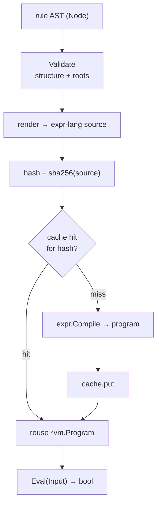

# Rules engine

A [grant](../getting-started/concepts.md#grant) can be gated on the *attributes*
of a request — deny a `read` unless the object's classification is `public`,
allow a `share` only for principals above a clearance tier. Aperture expresses
those conditions as **rules**. A rule is a small, typed **AST** that Aperture
compiles once to an expression program and evaluates in-process against the
object's metadata plus the principal/action context.

> **Aperture evaluates rules with [`expr-lang/expr`](https://github.com/expr-lang/expr)
> directly.** It renders each rule AST to an expr-lang expression and compiles it
> with expr-lang's pure-Go evaluator, in-process. There is **no external policy
> service and no dependency on Pulse** — any documentation that says "Pulse
> expression" is stale. The rules package imports `github.com/expr-lang/expr`;
> that is the whole engine.

The code lives in the `rules` package, in three layers: the AST (`ast.go`), the
compiler and cache (`compiler.go`, `cache.go`), and the engine (`engine.go`).

## The rule AST

A rule is a tree of `rules.Node` values. The node set is **deliberately small
and closed** so a node editor can map its palette one-to-one onto it, and so the
JSON form is a stable contract that round-trips byte-identically
(marshal → unmarshal → marshal). There is no second rule format.

| `NodeType` | Fields used | Meaning |
|---|---|---|
| `and` | `Children` (≥ 2) | logical conjunction |
| `or` | `Children` (≥ 2) | logical disjunction |
| `not` | `Children` (exactly 1) | logical negation |
| `compare` | `Op`, `Left`, `Right` | a comparison; `Right` is omitted for the unary operators |
| `var` | `Name` (dotted path) | a context-variable reference |
| `literal` | `Value` (scalar JSON) | a string, number, bool, or null constant |
| `list` | `Items` | an ordered list, the right side of a collection operator |
| `call` | `Name`, `Items` (args) | a call to a registered pure function |

The operators carried in `compare.Op` are covered in
[the operator vocabulary](#the-operator-vocabulary) below.

Constructor helpers build the tree in Go — `And`, `Or`, `Not`, `Compare`,
`Unary`, `Var`, `Lit`, `List`, `Call`. This rule says *the object is public, or
the principal's tier is one of gold/platinum*:

```go
ast := rules.Or(
    rules.Compare(rules.OpEq, rules.Var("object.classification"), rules.Lit("public")),
    rules.Compare(rules.OpIn, rules.Var("principal.tier"),
        rules.List(rules.Lit("gold"), rules.Lit("platinum"))),
)
```

Its canonical JSON — the shape the editor and the state file persist — omits
every zero field, keeping the serialized form minimal:

```json
{
  "type": "or",
  "children": [
    {"type": "compare", "op": "eq",
     "left": {"type": "var", "name": "object.classification"},
     "right": {"type": "literal", "value": "public"}},
    {"type": "compare", "op": "in",
     "left": {"type": "var", "name": "principal.tier"},
     "right": {"type": "list", "items": [
       {"type": "literal", "value": "gold"},
       {"type": "literal", "value": "platinum"}]}}
  ]
}
```

### The evaluation context

A rule reads from a **closed set of four roots**, and only those — a reference to
anything else is an unknown variable:

| Root | Type | Contents |
|---|---|---|
| `object` | map | the object's metadata snapshot (host-defined fields, e.g. `object.classification`) |
| `principal` | map | the principal's attribute bag (e.g. `principal.tier`); the floor `{id, kind}` is always present |
| `account` | map | account attributes |
| `action` | string | the action verb (`action == "read"`) |

The three metadata roots are `map[string]any` so a rule reads host-defined
fields dynamically; `action` is a typed string so misusing it (`action.foo`) is
a type error. This closed environment is enforced twice — structurally by
`Validate` (below) and again by the expr-lang type-checker at compile time.

## The operator vocabulary

There are **eleven** comparison operators beyond the six scalar ones. All of them
are values of `compare.Op` — none is editor-only sugar, because the AST is the
editor's serialization target and the state file's persisted form: a rule
authored as *has all* must read back as *has all*.

### Scalar comparisons

| `Op` | Reads as | Renders to |
|---|---|---|
| `eq` / `ne` | `object.tier == "gold"` | `==` / `!=` |
| `lt` `le` `gt` `ge` | `object.level >= 3` | `<` `<=` `>` `>=` |

Both operands are required and either may be any operand node.

### Collection operators

`Left` is the collection being tested (for `exists`, any path at all). `Right` is
the operand — and the last three operators are **unary**: they reuse the same
`compare` node with `Right` **omitted**, rather than introducing a new node type.

| `Op` | Reads as | `Left` applies to | `Right` |
|---|---|---|---|
| `in` | `object.region in ["us","eu"]` | any | a `list` or a `var` |
| `nin` | `principal.id not in object.blocklist` | any | a `list` or a `var` |
| `has` | `object.tags has "urgent"` | array | one element — never a `list` |
| `hasAll` | `object.tags has all ["a","b"]` | array | a `list` or a `var` |
| `hasAny` | `object.tags has any ["a","b"]` | array | a `list` or a `var` |
| `hasNone` | `object.tags has none ["a","b"]` | array | a `list` or a `var` |
| `subsetOf` | `object.tags subset of ["a","b"]` | array | a `list` or a `var` |
| `hasKey` | `object.owner has key "dept"` | object | one element — never a `list` |
| `isEmpty` | `object.tags is empty` | array, object | **omitted** |
| `isNotEmpty` | `object.tags is not empty` | array, object | **omitted** |
| `exists` | `object.owner.dept exists` | any path | **omitted** |

```go
// "tagged both a and b, in no blocked region, and it actually has an owner"
rules.And(
    rules.Compare(rules.OpHasAll, rules.Var("object.tags"),
        rules.List(rules.Lit("a"), rules.Lit("b"))),
    rules.Compare(rules.OpHasNone, rules.Var("object.regions"),
        rules.Var("account.blockedRegions")),
    rules.Unary(rules.OpExists, rules.Var("object.owner.dept")),
)
```

`rules.Unary(op, left)` builds a unary node; it is still a `compare` node, and
its JSON simply carries no `right` key:

```json
{"type":"compare","op":"isEmpty","left":{"type":"var","name":"object.tags"}}
```

That omission is part of the contract. `Validate` requires `Right == nil` for
exactly `isEmpty`, `isNotEmpty` and `exists` and **rejects a supplied one**, so
there is only ever one spelling of a unary rule and the JSON round-trips
byte-identically. Every other operator still requires both operands.

### How each operator compiles

`expr.DisableAllBuiltins()` is in force, so nothing may be *assumed* reachable.
Each operator makes a deliberate choice:

| Strategy | Operators | Rendered form |
|---|---|---|
| Native infix | `eq ne lt le gt ge in nin` | `(left <op> right)` |
| Native, flipped `in` | `has`, `hasKey` | `(right in left)` |
| Native nil test | `exists` | `(left != nil)` |
| Registered pure function | `hasAll` `hasAny` `hasNone` `subsetOf` `isEmpty` `isNotEmpty` | `hasAll(left, right)`, `isEmpty(left)`, … |
| **Guarded dispatcher** | any collection operator over a non-literal operand | `$op("hasAll", __notes, "object.tags", object?.tags, "", ["a"])` |

`has` and `hasKey` need no new machinery because expr's `in` is element
membership over an array **and key membership over a map** — `"dept" in
object.owner` is already the `hasKey` semantics, so the operator is pure
spelling. `exists` leans on the [optional chaining](#nested-access-is-nil-safe)
`var` already renders, which is what makes `object.owner.dept exists` false
rather than a runtime error when `owner` is missing.

The six with no native spelling are backed by functions in the curated pure set.
Each is deterministic and side-effect-free, so the purity guarantee holds: they
read their arguments and nothing else.

The **guarded** row overrides the other four. A collection operator whose
collection operand is not statically known to be a collection — anything but a
list literal, so in practice any operand that reads metadata — renders to the
internal dispatcher `$op` instead, which applies the [shape
policy](#wrong-shaped-fields-deny-and-are-recorded) and records a note. The
common `object.region in ["us","eu"]` keeps its native `in`: a list literal is an
array by construction and cannot mismatch, so the decision path pays nothing for
a guard it does not need.

Neither `$op` nor the `__notes` sink it reads is reachable from a rule. `$` is
outside the identifier grammar `Validate` enforces for a `call` name, and
`__notes` is not one of the four exposed context roots — so the guard is
compiler-only *by construction*, with no denylist to keep in sync.

### Predicate builtins are denied

`expr.DisableAllBuiltins()` does not do everything its name suggests. expr's
fifteen **predicate** builtins — `all`, `any`, `none`, `one`, `filter`, `map`,
`count`, `sum`, `find`, `findIndex`, `findLast`, `findLastIndex`, `groupBy`,
`sortBy`, `reduce` — are resolved by the parser *before* it consults the disabled
table, so `all(...)` still compiles under Aperture's option set while `len(...)`
genuinely does not. Nothing in the AST emits expr's `#` pointer, so none is
reachable through a well-formed rule today — but a `call` node renders
`name(args…)` verbatim, so `Call("all", …)` would compile. `Validate` therefore
rejects those names outright with `APERTURE_RULE_INVALID`, and a test pins the
callable set against expr's own builtin registry.

## Missing fields and nested access

Metadata is host-defined and ragged: one object carries an `owner`, the next does
not. Two behaviors follow from that, and both matter for whether a rule *grants*.

### Nested access is nil-safe

A `var` may read a nested path — `object.owner.dept`. Aperture renders every
segment after the root with optional chaining, so that path compiles to
`object?.owner?.dept`. If `owner` is absent the read yields **nil**, the
enclosing comparison goes **false**, and the rule simply does not select.

This matters because the un-chained form is *not* nil-safe: in expr-lang,
`object.owner.dept` against an object with no `owner` is a **runtime error**
(`cannot fetch dept from <nil>`), which would surface as `APERTURE_RULE_EVAL` at
`Check` time. A rule that works against every object carrying an `owner` would
otherwise blow up on the one object that lacks it — in production, not in dev.
Optional chaining makes that uniform and deny-safe, so no rule author has to
write a guard. A path through a **present** intermediate behaves exactly as
before; `?.` differs from `.` only when the receiver is nil.

```go
// Selects only for objects that actually carry owner.dept == "eng".
// An object with no owner at all evaluates to false, never an error.
rules.Compare(rules.OpEq, rules.Var("object.owner.dept"), rules.Lit("eng"))
```

### ⚠️ `nin` over a field the object lacks **grants**

`in` and `nin` over a missing field do not error — but they are not symmetric in
their consequences:

| Expression | Object has the field | Object lacks the field |
|---|---|---|
| `x in object.blocklist` | membership | **`false`** — does not select |
| `x not in object.blocklist` | non-membership | **`true`** — **selects** |

`x not in <nil>` evaluating to `true` is the correct logical dual, and it is
expr-lang's pre-existing behavior, not something Aperture introduces. But the
practical effect is a trap: **a deny-list rule written with `nin` passes every
object that is simply missing the column.** A typo'd field name, a CSV without
that header, or a nested path through an absent intermediate all read as nil —
and the rule grants.

List-valued and nested metadata make this far easier to hit than it used to be.
If a rule must not select for objects lacking the field, require the field
explicitly:

```go
rules.And(
    rules.Compare(rules.OpNe, rules.Var("object.blocklist"), rules.Lit(nil)),
    rules.Compare(rules.OpNin, rules.Var("principal.id"), rules.Var("object.blocklist")),
)
```

### Collection operators: an absent field reads as an empty collection

Every collection operator applies the same rule — **an absent array or object is
not an error, it is an empty one**. Which way that falls out depends on the
operator's polarity, and the negative operators grant exactly the way `nin` does:

| Field absent | `has` | `hasAll` | `hasAny` | `hasKey` | `isNotEmpty` | `exists` | `hasNone` | `subsetOf` | `isEmpty` |
|---|---|---|---|---|---|---|---|---|---|
| result | `false` | `false` | `false` | `false` | `false` | `false` | ⚠️ `true` | ⚠️ `true` | ⚠️ `true` |

`hasNone` and `subsetOf` are the ones to watch: *no forbidden tag* and *only
allowed tags* are both trivially satisfied by an object that carries no tags at
all. Pair them with `exists` (or `isNotEmpty`) when the field must be present:

```go
rules.And(
    rules.Unary(rules.OpIsNotEmpty, rules.Var("object.tags")),
    rules.Compare(rules.OpHasNone, rules.Var("object.tags"),
        rules.List(rules.Lit("restricted"))),
)
```

### Wrong-shaped fields deny, and are recorded

A field of the **wrong shape** — `has` over a string, `hasAll` over a number,
`isEmpty` over a bool — makes the comparison **`false`**. Every collection
operator, no exceptions, *including the negative ones*: `nin` over a string is
`false`, not `true`. A mismatch never matches, whatever the operator's polarity,
so mistyped data can only ever deny.

expr-lang on its own is not like this. `"a" in object.missing` is `false`, but
`"a" in object.title` is the runtime error `operator "in" not defined on string`
— so inheriting expr's behavior would mean one mistyped field breaks **every**
`Check` that touches it. Load-time validation of the [value
model](./providers.md) stops mistyped data from the CSV and inline loaders, but
it cannot cover a host-implemented `ObjectProvider` or the `principal` attribute
bag, which bypass loaders entirely. Hence a runtime policy as well.

Note the asymmetry with the absent-field table above, and that it is deliberate:

| operand | policy |
|---|---|
| absent (`nil`) | reads as an **empty collection**; the operator's own semantics decide, so the negative ops match |
| wrong shape | the comparison is **`false`**, whatever the operator |

Treating a mismatch as an empty collection would have been more uniform, but it
would make `nin` / `hasNone` / `subsetOf` **grant** on mistyped data. Deny-safety
wins the tiebreak.

Which shapes each operator accepts:

| operators | accepts |
|---|---|
| `in` `nin` `has` `hasKey` | array (elements) or object (keys) |
| `hasAll` `hasAny` `hasNone` `subsetOf` | array |
| `isEmpty` `isNotEmpty` | array, object, or string |
| `exists` | anything — a nil test cannot mismatch |

#### Evaluation notes

A silent `false` is how an access-control bug hides. So the mismatch is
**recorded** and surfaced in `Explain`, on every decision surface:

```
Explain alice/read on account:acme/document:9 in account acme
  subjects: principal:alice
  grants considered (1):
     g-doc [allow account:acme/**] inclusive scope does not cover the object
  evaluation notes (1):
     g-doc [rule tagged]: object.tags: expected collection, got string
  verdict: DENY (top specificity 0)
```

A second kind of note covers the other invisible case: an operator that
**matched because the field is missing** — the `nin` / `hasNone` / `subsetOf` /
`isEmpty` grant described above.

```
     g-doc [rule tagged]: object.tags: absent; hasNone matched because the field is missing
```

Notes carry **shape and path only — never a metadata value**, because a trace
crosses account boundaries the same way an error message does. They are
diagnostic only and never influence a verdict, and only `Explain` collects them:
`Check` and `Enumerate` install no collector, so the decision hot path records
nothing and allocates nothing.

Library callers reach the same channel directly:

```go
ctx, notes := rules.WithNoteCollector(ctx)
allowed, err := compiled.Eval(ctx, in)
for _, n := range notes.Notes() {
    log.Println(n) // object.tags: expected collection, got string
}
```

### Other missing-field behavior

- **Equality** against a missing field is `false` (nil never equals a scalar).
- **Ordered comparison** (`lt le gt ge`) against a missing field is a **runtime
  error** — `APERTURE_RULE_EVAL`. The rule assumes a field the object does not
  carry; the scope resolver treats that as a non-decision, not a silent select.

## Validation

`Node.Validate()` checks that a node and its subtree are **structurally
well-formed** — the closed node set, the correct arities (`and`/`or` need ≥ 2
children, `not` exactly 1, `compare` the operands its operator calls for), a known
comparison operator, a scalar literal, and a variable whose first path segment
is one of the four roots. It returns `APERTURE_RULE_INVALID` for a malformed node
and `APERTURE_RULE_UNKNOWN_VARIABLE` for a variable outside the exposed roots.

Validation is **pure structure** — it does not type-check and never touches the
expression engine. Beyond arity it enforces, per operator:

- A literal carries a scalar (arrays and objects are rejected; use a `list` node
  for collections).
- `isEmpty` / `isNotEmpty` / `exists` carry **no** `right` operand; every other
  operator carries one.
- `in` `nin` `hasAll` `hasAny` `hasNone` `subsetOf` take a `list` or a `var` on
  the right.
- `has` / `hasKey` take a single element on the right — a `list` there is an
  error that points at `hasAll`/`hasAny`/`hasNone`.
- A `call` may not name one of expr's [predicate
  builtins](#predicate-builtins-are-denied).

For the *deep* check — structure **plus** a full compile pass that surfaces type
errors and unknown functions — call `rules.ValidateAST(raw)`. It decodes a JSON
AST and compiles it against a shared package-level validator (nil source, nil
fetcher — it resolves no references and fetches no metadata), returning nil for a
compilable rule and an `APERTURE_RULE_*` code otherwise. This is what a
save/validate surface runs before persisting a rule.

## Compilation and caching

`Node.Expr()` renders the validated AST to an expr-lang expression string. The
rendering is direct and injection-free (variable paths are Go-style identifiers,
string literals are quoted, integers keep their exact form via `json.Number`):

```text
((object?.classification == "public") || (principal?.tier in ["gold", "platinum"]))
```

Every path segment **after the root** renders with expr-lang's optional chaining
(`?.`); the root itself is a typed environment field and needs none. That is what
makes nested reads nil-safe — see [Missing fields and nested
access](#missing-fields-and-nested-access) below. The AST is unchanged: a `var`
node still stores the plain dotted path (`object.owner.dept`), so the JSON form
the editor and the state file share carries no `?`.

`Compiler.Compile(node)` validates, renders, and compiles that expression to a
reusable `*vm.Program` via `expr.Compile`. Every compiler fixes the same options:

- **`expr.Env(evalEnv{})`** — the typed four-root environment, so any other
  top-level identifier is an unknown name at compile time.
- **`expr.AsBool()`** — a rule must evaluate to a boolean.
- **`expr.DisableAllBuiltins()`** — expr-lang's builtin library is off, so **no
  wall-clock or random function is reachable** and evaluation stays
  deterministic. It does not cover the predicate builtins; `Validate`
  [denies those by name](#predicate-builtins-are-denied).
- **The curated pure function set** — `lower`, `upper`, `contains`, `startsWith`,
  `endsWith`, `len`, plus the collection-operator backings `hasAll`, `hasAny`,
  `hasNone`, `subsetOf`, `isEmpty`, `isNotEmpty`. A host adds its own
  deterministic, side-effect-free functions with `rules.Function(name, fn)` /
  `Engine WithFunction`; these join (and can shadow) the curated set. An unknown
  function is caught at compile time. Note that `contains`, `startsWith` and
  `endsWith` are reserved as **infix operators** by expr's grammar, so they are
  registered but cannot be reached through a `call` node; the other nine can.

A compile failure that survives validation is a type mismatch, a non-boolean
result, or a call to an unregistered function — all surfaced as
`APERTURE_RULE_TYPE_ERROR`, with the evaluator's own message preserved in context.
A `Compiled` is immutable and safe for concurrent evaluation; it carries the
canonical `Source()` and its `Hash()` (sha256 of the source).

### The compiled-rule cache

Compiling an expression is the expensive step, and `Check` runs on a tight
latency budget, so a compile happens **once per canonical form**. The engine keys
a `compiledCache` by the rule's canonical hash. Two different rule references
whose ASTs render to the *same* expression share a single compiled program.



The cache is concurrency-safe and exposes `Hits / Misses / Evictions / Entries`
via `Engine.CacheStats()`. An optional TTL (`WithCacheTTL`, with an injectable
`Clock` for deterministic tests) bounds entry lifetime; TTL ≤ 0 keeps entries
until explicit invalidation. When a rule's definition changes underneath a cached
compilation, a host calls `Engine.Invalidate(node)` (drop one) or
`Engine.InvalidateAll()` (clear).

## Evaluation and the engine

`Compiled.Eval(ctx, Input)` runs the program against an `Input` — `Object`,
`Principal`, and `Account` maps plus the `Action` string (a nil map reads as
empty). Evaluation is **pure**: it reads only the input, mutates nothing (the
object metadata snapshot is treated read-only), and exposes no nondeterministic
function. A runtime failure or a non-boolean result is `APERTURE_RULE_EVAL`.

`rules.Engine` ties the pieces together. It is built over a `RuleSource` (which
resolves an opaque rule reference to its `Rule` definition — `MapSource` is the
in-memory default; a missing reference yields `APERTURE_RULE_NOT_FOUND`) and a
`MetadataFetcher` (whose signature matches `*provider.Registry.Fetch`, so a
[provider registry](providers.md) wires in directly as the object-metadata
source without the rules package importing `provider`). An optional
`PrincipalResolver` supplies principal attributes, keyed by
`Attributes(ctx, kind, principal)`. A resolver returns the **host's bag alone**;
returning `nil` is a complete answer, because the engine stamps the floor over
whatever comes back. The `kind` is `model.PrincipalKind`'s
spelling (`"user"` / `"machine"`) carried as a string, so one resolver can
dispatch to a different attribute source per kind — a human directory and a
service-account registry are rarely the same store. An **empty** kind means the
caller did not have the principal's record in hand: treat it as unknown, never
as a default, or a machine gets answered for out of the human directory.

### The floor bag, and `principal.kind`

`principal` always carries `{id, kind}`, whatever is wired. The floor is stamped
**last**, so a host bag with its own `id` or `kind` key cannot shadow it — the
realistic collision is innocent (a directory with an internal `id` column), and a
floor that can be shadowed silently changes what `principal.id == object.owner`
compares. An unknown kind is published as the empty string rather than omitted,
so "unknown" is a value a rule can compare against.

`kind` is published because attribute providers are registered **per kind**,
which makes a rule silently kind-dependent: a rule reading the user directory
finds nothing for a machine principal. In an **inclusive** grant that denies
safely; in an **exclusive** one — where being selected means being *excluded* — a
rule that quietly stops selecting **widens** access. `principal.kind` is how an
author states the dependence instead of hiding it:

```text
principal.kind == "user" && principal.tier == "gold"
```

### Wiring a `*provider.AttributeRegistry`

A `provider.AttributeRegistry` — the host seam that maps each of the three
attribute slots (`user`, `machine`, `account`) to a provider plus a per-slot
cache — is a `PrincipalResolver` as it stands, structurally, with `provider`
importing nothing from `rules`:

```go
attrs := provider.NewAttributeRegistry()
attrs.MustRegister(provider.AttributeSlotUser, userDirectory)
eng := rules.NewEngine(source, objects, rules.WithPrincipalResolver(attrs))
```

The kind picks the **slot**: `"user"` resolves the user slot, `"machine"` the
machine slot. `"account"` is a real slot but is **not** a principal kind, so it
never resolves here — a tenant's bag must never be served as a principal's.

A **missing source is not a failed decision**. A slot with no registered
provider, and a registered provider with no record for the key, both yield the
floor and no error, so a deployment with a human directory and no machine
directory keeps deciding normally. Everything else — an unreachable directory, a
bag the value model rejects — surfaces verbatim with its code and fixups intact
and is treated as a non-decision, because an outage must not read as "this
principal has no attributes".

`Engine.Selected(ctx, rule, object, account, principalKind, principal, action)`
is the full path:

1. resolve the rule reference through the `RuleSource`;
2. compile-and-cache its AST;
3. fetch the object's metadata (empty when no fetcher is configured);
4. resolve the principal's attributes for its kind, and stamp the floor over them
   into a fresh map (the resolver's bag may be cached and shared, and is
   read-only, transitively);
5. build the `Input` and evaluate.

`account` is accepted and **not yet read** — `Input.Account` is still the empty
map. It is in the signature ahead of the account attribute source that will
consume it so this exported signature breaks once rather than twice.

Any step's failure is an `APERTURE_*` coded error, and the caller treats it as a
**non-decision** — there is no select-on-error. That signature is exactly
`scope.RuleEvaluator`, which is how the rule-backed inclusive/exclusive
[scope strategies](scopes.md) get their variant: the engine is wired as
`scope.Deps{Rules: engine}`.

## Where this leads

Rules are one of two ways a scope strategy can decide object membership; the
other is an explicit id-list. See [scopes & scope strategies](scopes.md) for how
the inclusive and exclusive strategies consult a rule. The `object.*` fields a
rule reads come from [providers](providers.md).
